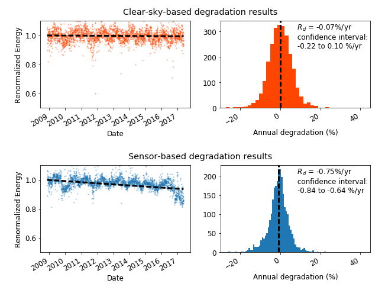

# About RdTools

RdTools is a set of Python tools for analysis of photovoltaic data.
In particular, PV production data is evaluated over several years
to obtain rates of performance degradation over time. Rdtools can
handle both high frequency (hourly or better) or low frequency (daily, weekly, etc.)
datasets. Best results are obtained with higher frequency data.

Full examples are worked out in the example notebooks in [rdtools/docs](./docs/degradation_example.ipynb).


## Workflow

0. Import and preliminary calculations
1. Normalize data using a performance metric
2. Filter data that creates bias
3. Aggregate data
4. Analyze aggregated data to estimate the degradation rate


## Degradation Results

The preferred method for degradation rate estimation is the year-on-year (YOY) approach,
available in `degradation.degradation_year_on_year`. The YOY calculation yields in a distribution
of degradation rates, the central tendency of which is the most representative of the true
degradation. The width of the distribution provides information about the uncertainty in the
estimate via a bootstrap calculation. The [example notebook](./docs/degradation_example.ipynb) uses the output of `degradation.degradation_year_on_year()`
to visualize the calculation.




Two workflows are available for system performance ratio calculation, and illustrated in an example notebook. 
The sensor-based approach assumes that site irradiance and temperature sensors are calibrated and in good repair.
Since this is not always the case, a 'clear-sky' workflow is provided that is based on
modeled temperature and irradiance.  Note that site irradiance data is still required to identify
clear-sky conditions to be analyzed.  In many cases, the 'clear-sky' analysis can identify conditions
of instrument errors or irradiance sensor drift, such as in the above analysis.


## Install RdTools using pip

RdTools can be installed automatically into Python from PyPI using the command line:  
`pip install rdtools`

Alternatively it can be installed mannually using the command line:  

1. Download a [release](https://github.com/NREL/rdtools/releases) (Or to work with a development version, clone or download the rdtools repository).
2. Navigate to the repository: `cd rdtools`
3. Install via pip: `pip install .`

## Usage


Full workflow examples are found in the notebooks in [rdtools/docs](./docs/degradation_example.ipynb).

The following functions are used for degradation analysis:

```
import rdtools
```

The most frequently used functions are:

```Python
normalization.normalize_with_pvwatts(energy, pvwatts_kws)
  '''
  Inputs: Pandas time series of raw energy, PVwatts dict for system analysis 
    (poa_global, P_ref, T_cell, G_ref, T_ref, gamma_pdc)
  Outputs: Pandas time series of normalized energy and POA insolation
  '''
```

```Python
filtering.poa_filter(poa); filtering.tcell_filter(Tcell); filtering.clip_filter(power); 
filtering.csi_filter(insolation, clearsky_insolation)
  '''
  Inputs: Pandas time series of raw data to be filtered.
  Output: Boolean mask where `True` indicates acceptable data
  '''
```

```Python
aggregation.aggregation_insol(normalized, insolation, frequency='D')
  '''
  Inputs: Normalized energy and insolation
  Output: Aggregated data, weighted by the insolation.
  '''
```

```Python
degradation.degradataion_year_on_year(aggregated)
  '''
  Inputs: Aggregated, normalized, filtered time series data
  Outputs: Tuple: `yoy_rd`: Degradation rate 
    `yoy_ci`: Confidence interval `yoy_info`: associated analysis data
  '''
```

## Citing RdTools

The underlying workflow of RdTools has been published in several places.  If you use RdTools in a published work, please cite the following:

  - D. Jordan, C. Deline, S. Kurtz, G. Kimball, M. Anderson, "Robust PV Degradation Methodology and Application",
  IEEE Journal of Photovoltaics, 2017
  
## References
The clear sky temperature calculation, `clearsky_temperature.get_clearsky_tamb()`, uses data
from images created by Jesse Allen, NASA’s Earth Observatory using data courtesy of the MODIS Land Group.  
https://neo.sci.gsfc.nasa.gov/view.php?datasetId=MOD_LSTD_CLIM_M  
https://neo.sci.gsfc.nasa.gov/view.php?datasetId=MOD_LSTN_CLIM_M

Other useful references which may also be consulted for degradation rate methodology include:

  - D. C. Jordan, M. G. Deceglie, S. R. Kurtz, “PV degradation methodology comparison — A basis for a standard”, in 43rd IEEE Photovoltaic Specialists Conference, Portland, OR, USA, 2016, DOI: 10.1109/PVSC.2016.7749593.
  - Jordan DC, Kurtz SR, VanSant KT, Newmiller J, Compendium of Photovoltaic Degradation Rates, Progress in Photovoltaics: Research and Application, 2016, 24(7), 978 - 989.
  - D. Jordan, S. Kurtz, PV Degradation Rates – an Analytical Review, Progress in Photovoltaics: Research and Application, 2013, 21(1), 12 - 29.
  - E. Hasselbrink, M. Anderson, Z. Defreitas, M. Mikofski, Y.-C.Shen, S. Caldwell, A. Terao, D. Kavulak, Z. Campeau, D. DeGraaff, “Validation of the PVLife model using 3 million module-years of live site data”, 39th IEEE Photovoltaic Specialists Conference, Tampa, FL, USA, 2013, p. 7 – 13, DOI: 10.1109/PVSC.2013.6744087.

## Unit tests

To run tests from the main directory:
```
$ tests/run_tests
```
## Further Instructions and Updates

Check out the [wiki](https://github.com/NREL/rdtools/wiki) for additional usage documentation, and for information on development goals and framework.

