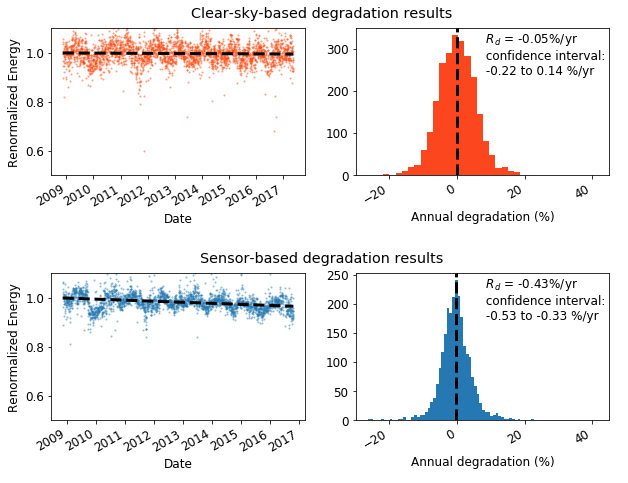
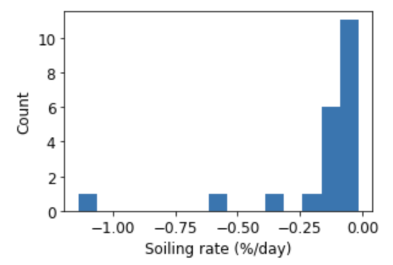
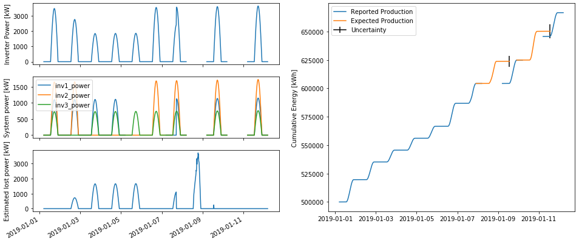

.. RdTools documentation master file, created by
   sphinx-quickstart on Wed Nov  6 11:54:52 2019.
   You can adapt this file completely to your liking, but it should at least
   contain the root `toctree` directive.

.. image:: _images/logo_horizontal_highres.png
   :width: 600

.. pipe character renders as a blank line, used as spacer after the logo
  |

RdTools Overview
================

RdTools is an open-source library to support reproducible technical analysis of
time series data from photovoltaic energy systems. The library aims to provide
best practice analysis routines along with the building blocks for users to
tailor their own analyses.
Current applications include the evaluation of PV production over several years to obtain
rates of performance degradation and soiling loss. They also include the capability to
analyze systems for system- and subsystem-level availability. RdTools can handle
both high frequency (hourly or better) or low frequency (daily, weekly,
etc.) datasets. Best results are obtained with higher frequency data.

Full examples are worked out in the example notebooks in the :ref:`examples`.

To report issues, contribute code, or suggest improvements to this
documentation, visit the RdTools development repository on `github`_.

Degradation and Soiling
-----------------------

Both degradation and soiling analyses are based on normalized yield, similar to performance
index. Usually, this is computed at the daily level although other aggregation periods are
supported. A typical analysis of soiling and degradation contains the following:

0. Import and preliminary calculations
1. Normalize data using a performance metric
2. Filter data that creates bias
3. Aggregate data
4. Analyze aggregated data to estimate the degradation rate and/or
   soiling loss

Steps 1 and 2 may be accomplished with the clearsky workflow (see the
:ref:`examples`) which can help eliminate problems from irradiance sensor
drift.

Degradation
^^^^^^^^^^^

The preferred method for degradation rate estimation is the year-on-year
(YOY) approach (Jordan 2018), available in :py:func:`.degradation.degradation_year_on_year`.
The YOY calculation yields in a distribution of degradation rates, the
central tendency of which is the most representative of the true
degradation. The width of the distribution provides information about
the uncertainty in the estimate via a bootstrap calculation. The
:ref:`examples` use the output of
:py:func:`.degradation.degradation_year_on_year` to visualize the calculation.

Two workflows are available for system performance ratio calculation,
and illustrated in an example notebook. The sensor-based approach
assumes that site irradiance and temperature sensors are calibrated and
in good repair. Since this is not always the case, a 'clear-sky'
workflow is provided that is based on modeled temperature and
irradiance. Note that site irradiance data is still required to identify
clear-sky conditions to be analyzed. In many cases, the 'clear-sky'
analysis can identify conditions of instrument errors or irradiance
sensor drift, such as in the above analysis.

The clear-sky analysis tends to provide less stable results than sensor-based
analysis when details such as filtering are changed. We generally recommend
that the clear-sky analysis be used as a check on the sensor-based results,
rather than as a stand-alone analysis.

Soiling
^^^^^^^

Soiling can be estimated with the stochastic rate and recovery (SRR)
method (Deceglie 2018). This method works well when soiling patterns
follow a "sawtooth" pattern, a linear decline followed by a sharp
recovery associated with natural or manual cleaning.
:py:func:`.soiling.soiling_srr` performs the calculation and returns the P50
insolation-weighted soiling ratio, confidence interval, and additional
information (``soiling_info``) which includes a summary of the soiling
intervals identified, ``soiling_info['soiling_interval_summary']``. This
summary table can, for example, be used to plot a histogram of the
identified soiling rates for the dataset.

Availability
------------

Evaluating system availability can be confounded by data loss from interrupted
datalogger or system communications. RdTools implements two methods
(Anderson & Blumenthal 2020) of distinguishing nuisance communication
interruptions from true production outages
with the :py:class:`.availability.AvailabilityAnalysis` class. In addition to
classifying data outages, it estimates lost production and calculates
energy-weighted system availability.

Install RdTools using pip
-------------------------

RdTools can be installed automatically into Python from PyPI using the
command line:

::

    pip install rdtools

Alternatively it can be installed manually using the command line:

1. Download a `release`_ (Or to work with a development version, clone
   or download the rdtools repository).
2. Navigate to the repository: ``cd rdtools``
3. Install via pip: ``pip install .``

On some systems installation with ``pip`` can fail due to problems
installing requirements. If this occurs, the requirements specified in
``setup.py`` may need to be separately installed (for example by using
``conda``) before installing ``rdtools``.

For more detailed instructions, see the :ref:`developer_notes` page.

RdTools currently is tested on Python 3.6+.

Usage and examples
------------------

Full workflow examples are found in the notebooks in :ref:`examples`.
The examples are designed to work with python 3.7. For a consistent
experience, we recommend installing the packages and versions documented
in ``docs/notebook_requirements.txt``. This can be achieved in your
environment by first installing RdTools as described above, then running
``pip install -r docs/notebook_requirements.txt`` from the base
directory.

The following functions are used for degradation and soiling analysis:

.. code:: python

   import rdtools

The most frequently used functions are:

.. code:: python

   normalization.normalize_with_expected_power(pv, power_expected, poa_global,
                                               pv_input='power')
     '''
     Inputs: Pandas time series of raw power or energy, expected power, and
        plane of array irradiance.
     Outputs: Pandas time series of normalized energy and POA insolation
     '''

.. code:: python

   filtering.poa_filter(poa_global); filtering.tcell_filter(temperature_cell); 
   filtering.clip_filter(power_ac); filtering.normalized_filter(energy_normalized);
   filtering.csi_filter(poa_global_measured, poa_global_clearsky); 
     '''
     Inputs: Pandas time series of raw data to be filtered.
     Output: Boolean mask where `True` indicates acceptable data
     '''

.. code:: python

   aggregation.aggregation_insol(energy_normalized, insolation, frequency='D')
     '''
     Inputs: Normalized energy and insolation
     Output: Aggregated data, weighted by the insolation.
     '''

.. code:: python

   degradation.degradation_year_on_year(energy_normalized)
     '''
     Inputs: Aggregated, normalized, filtered time series data
     Outputs: Tuple: `yoy_rd`: Degradation rate 
       `yoy_ci`: Confidence interval `yoy_info`: associated analysis data
     '''

.. code:: python

   soiling.soiling_srr(energy_normalized_daily, insolation_daily)
     '''
     Inputs: Daily aggregated, normalized, filtered time series data for normalized performance and insolation
     Outputs: Tuple: `sr`: Insolation-weighted soiling ratio 
       `sr_ci`: Confidence interval `soiling_info`: associated analysis data
     '''

.. code:: python

   availability.AvailabilityAnalysis(power_system, power_subsystem,
                                     energy_cumulative, power_expected)
     '''
     Inputs: Pandas time series system and subsystem power and energy data
     Outputs: DataFrame of production loss and availability metrics
     '''

Citing RdTools
--------------

The underlying workflow of RdTools has been published in several places.
If you use RdTools in a published work, please cite the following as
appropriate:

-  D. Jordan, C. Deline, S. Kurtz, G. Kimball, M. Anderson, "Robust PV
   Degradation Methodology and Application", IEEE Journal of
   Photovoltaics, 8(2) pp. 525-531, 2018
   ‌‌
-  M. G. Deceglie, L. Micheli and M. Muller, "Quantifying Soiling Loss
   Directly From PV Yield," in IEEE Journal of Photovoltaics, 8(2),
   pp. 547-551, 2018

-  K. Anderson and R. Blumenthal, "Overcoming Communications Outages in
   Inverter Downtime Analysis", 2020 IEEE 47th Photovoltaic Specialists
   Conference (PVSC)."
   ‌‌
-  RdTools, version x.x.x, https://github.com/NREL/rdtools,
   https://doi.org/10.5281/zenodo.1210316
   
   + Be sure to include the version number used in your analysis!

References
----------

- The clear sky temperature calculation,
  :py:func:`.clearsky_temperature.get_clearsky_tamb()`, uses data from images
  created by Jesse Allen, NASA’s Earth Observatory using data courtesy
  of the MODIS Land Group.
    
    + https://neo.sci.gsfc.nasa.gov/view.php?datasetId=MOD_LSTD_CLIM_M
    + https://neo.sci.gsfc.nasa.gov/view.php?datasetId=MOD_LSTN_CLIM_M

Other useful references which may also be consulted for degradation rate
methodology include:

-  D. C. Jordan, M. G. Deceglie, S. R. Kurtz, "PV degradation
   methodology comparison — A basis for a standard", in 43rd IEEE
   Photovoltaic Specialists Conference, Portland, OR, USA, 2016, DOI:
   10.1109/PVSC.2016.7749593.
-  Jordan DC, Kurtz SR, VanSant KT, Newmiller J, Compendium of
   Photovoltaic Degradation Rates, Progress in Photovoltaics: Research
   and Application, 2016, 24(7), 978 - 989.
-  D. Jordan, S. Kurtz, PV Degradation Rates – an Analytical Review,
   Progress in Photovoltaics: Research and Application, 2013, 21(1), 12
   - 29.
-  E. Hasselbrink, M. Anderson, Z. Defreitas, M. Mikofski, Y.-C.Shen, S.
   Caldwell, A. Terao, D. Kavulak, Z. Campeau, D. DeGraaff, "Validation
   of the PVLife model using 3 million module-years of live site data",
   39th IEEE Photovoltaic Specialists Conference, Tampa, FL, USA, 2013,
   p. 7 – 13, DOI: 10.1109/PVSC.2013.6744087.

.. include a toctree entry here so that the index page appears in the sidebar

.. toctree::
   :hidden:

   self

Documentation Contents
======================

.. toctree::
   :maxdepth: 2

   Examples <examples>
   API Reference <api>
   Change Log <changelog>
   Developer Notes <developer_notes>

Indices and tables
==================

* :ref:`genindex`
* :ref:`modindex`
* :ref:`search`

.. links and references

.. _release: https://github.com/NREL/rdtools/releases
.. _github: https://github.com/NREL/rdtools
