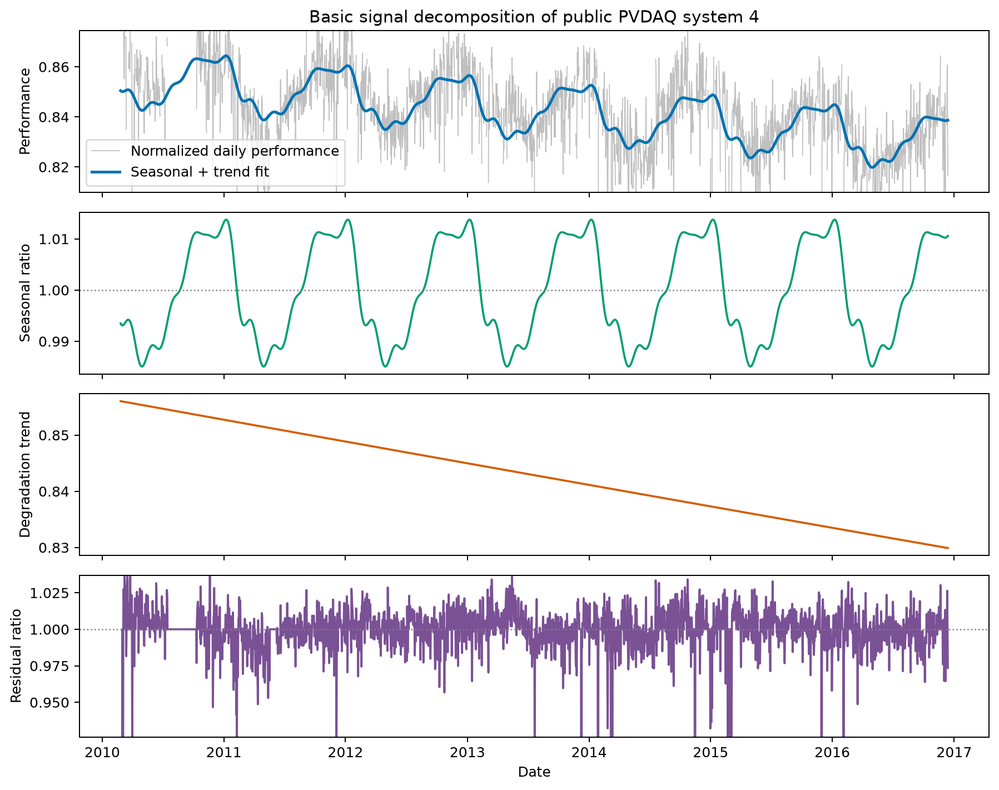
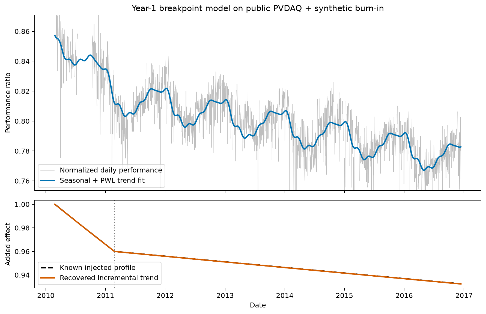

Signal decomposition
====================

Signal decomposition (SD) provides a **superset of RdTools' existing
degradation-and-soiling analysis capabilities** through one mathematical
framework. It separates daily normalized PV performance into interpretable
seasonal, long-term trend, soiling, and residual components. The established
jobs—a scalar degradation rate with uncertainty, separate early- and
later-life rates, nonlinear degradation histories, and soiling loss and rate
estimation—can therefore be expressed as related decomposition problems rather
than as a collection of unrelated estimators. The same framework also enables
new structural diagnostics and component combinations.

The mathematical foundation for this framework is developed in
`Meyers and Boyd (2023) <https://doi.org/10.1561/2000000122>`_.

This is a superset of *analysis jobs and outputs*, not a claim that SD is
numerically identical to year-on-year (YOY), hybrid, SRR, or CODS. Those methods
retain their own assumptions and estimators. SD offers a common mathematical
theory that can reproduce their high-level use cases and extend them.

.. list-table:: Established analyses and their SD counterparts
   :header-rows: 1
   :widths: 28 29 43

   * - Analysis job
     - SD model
     - Added capability
   * - Overall degradation rate and uncertainty
     - Linear trend with final-model bootstrap
     - Joint seasonal/trend estimation and component diagnostics
   * - Distinct early- and mature-life rates
     - Continuous year-1 breakpoint trend
     - Direct comparison with linear and nonlinear trend claims
   * - Time-varying degradation
     - Smooth non-increasing trend
     - Annual and instantaneous rate histories
   * - Behavior across the performance distribution
     - Monotone conditional-quantile sweep
     - Diagnosis of burn-in and increasing late-life failures
   * - Soiling loss and local soiling rate
     - SD++ structural selection and IRL1 refinement
     - Explicit structural null, component recovery, and unified uncertainty

The guide develops that progression through three uses:

1. a linear degradation estimate with a bootstrap confidence interval;
2. expanded trend diagnostics using a year-1 breakpoint, a nonlinear monotone
   trend, and conditional-quantile fits; and
3. SD++ soiling analysis, which estimates degradation and conventional dry
   soiling through a deterministic sequence of SD problems.

All current models assume daily aggregation and use an annual period of
365.2425 days. Missing daily values are allowed. The model links the components
to the observations only on days with finite data.

The basic RdTools SD trend model
---------------------------------

RdTools begins with a three-component decomposition of normalized daily PV
performance on the model's working scale. The natural-log scale is recommended
and used by default because PV performance changes, degradation, and seasonal
effects are naturally interpreted as proportional rather than additive. Set
``log_transform=False`` explicitly to fit on the original ratio scale.

.. math::

   y_t = s_t + g_t + r_t,

where :math:`s_t` is an annually periodic seasonal component, :math:`g_t` is
the long-term degradation trend, and :math:`r_t` is the unexplained residual.
The components are estimated jointly, so the reported degradation rate is
extracted from :math:`g_t` after the model has separated recurring seasonal
variation from long-term change. The selected ``trend_type`` determines the
structural claim made by :math:`g_t`: linear, continuous piecewise-linear with
a year-1 breakpoint, or smooth non-increasing.

         fitted seasonal component, linear degradation trend, and residual.
   :width: 100%

   The default basic SD model applied through ``sensor_analysis`` to the public
   PVDAQ system 4 example. Each panel exposes one part of the jointly estimated
   decomposition rather than only reporting a scalar degradation rate. The
   displayed y-axis limits emphasize the fitted components; extreme residuals
   are clipped visually but remain in the input to the robust fit.

This basic model is the foundation for all of the trend analyses below. SD++
soiling extends it by adding a conventional dry-soiling component
:math:`c_t`:

.. math::

   y_t = s_t + g_t + c_t + r_t.

For SD++ the working scale is the natural logarithm, so the fitted user-facing
soiling ratio is :math:`\exp(c_t)`. The additional component is constrained and
penalized to represent gradual loss interrupted by cleaning recoveries. Because
a flexible component should not be included merely because it improves fit,
SD++ wraps this extended model in a fixed sequence of regularization-path
solves, structural selection, IRL1 refinement, and final-model bootstrap. If
the structural evidence for soiling is absent, it returns to the basic
three-component model and reports an exact unity soiling ratio.

Choosing a residual loss
------------------------

The residual loss specifies how disagreement between the observed normalized
performance and the structural components is measured. It changes which part
of the performance distribution the fitted seasonal and trend components
describe; it does not change the chosen trend class.

.. list-table:: Residual loss options
   :header-rows: 1
   :widths: 14 35 51

   * - ``loss``
     - Statistical target
     - When to use it
   * - ``"l2"``
     - Conditional mean, using squared residuals
     - Efficient for approximately symmetric, light-tailed residuals, but
       large residuals have strong influence.
   * - ``"l1"``
     - Conditional median, using absolute residuals
     - A robust alternative when occasional large deviations should have less
       influence than under L2 loss.
   * - ``"huber"``
     - Mean-like center with quadratic treatment of small residuals and linear
       treatment of large residuals
     - The default and recommended loss. It is a smooth compromise between L2
       and L1. ``huber_M`` sets the transition scale; the default is 0.05 for
       normalized PV performance near unity.
   * - ``"quantile"``
     - Conditional quantile, using asymmetric pinball loss
     - Diagnose whether degradation behavior differs across the performance
       distribution. ``q`` selects the quantile in the open interval (0, 1).

Pass the choice through ``sd_kwargs`` on the normal
:meth:`~rdtools.analysis_chains.TrendAnalysis.sensor_analysis` workflow. For
example, a median fit uses:

.. code-block:: python

   analysis.sensor_analysis(
       analyses=["signal_decomposition"],
       sd_kwargs={
           "trend_type": "linear",
           "loss": "l1",
           "n_bootstrap": 500,
           "random_state": 42,
       },
   )

Leaving ``loss`` and ``log_transform`` unspecified selects the recommended
log-Huber basic model with ``huber_M=0.05``. Ordinary degradation analyses may
override all three choices. SD++ soiling uses the same log-Huber residual
preset, but there it is part of the frozen detection and estimation algorithm
and is not a user-tuning choice.

Typical degradation estimation
------------------------------

The default model is the closest SD analogue to a typical year-on-year
degradation analysis. It uses an annual Fourier seasonal component, a linear
long-term trend, and a Huber residual loss after taking the natural logarithm
of normalized performance. A moving-block residual bootstrap supplies the
uncertainty interval.

.. code-block:: python

   analysis.sensor_analysis(
       analyses=["signal_decomposition"],
       sd_kwargs={
           "trend_type": "linear",
           "n_bootstrap": 500,
           "random_state": 42,
       },
   )

   sd_result = analysis.results["sensor"]["signal_decomposition"]
   print(f"Degradation: {sd_result['rd_pct']:.2f}%/year")
   print(f"68.2% confidence interval: "
         f"{sd_result['rd_confidence_interval']}")

Here, ``analysis`` is an initialized
:class:`~rdtools.analysis_chains.TrendAnalysis` object with measured PV and
weather inputs. ``sensor_analysis`` performs the standard normalization,
filtering, and daily aggregation workflow before invoking signal decomposition.
Negative rates indicate declining performance. ``rd_pct`` is the fitted linear
trend rate in percent per year and ``rd_confidence_interval`` is its bootstrap
confidence interval. ``sd_result["sd_trend_results"]`` contains the fitted
components, model arguments, bootstrap results, and solver status.

SD and year-on-year analysis answer similar high-level questions but use
different estimators. Year-on-year forms a distribution of annual changes. SD
fits the seasonal and trend components jointly, then estimates uncertainty by
resampling the final model's residuals. Agreement between the methods is useful
evidence; disagreement is a reason to inspect the fitted trend, seasonal
component, filtering, and data coverage.

Use the :class:`~rdtools.analysis_chains.TrendAnalysis` plotting method to
inspect the components rather than relying only on the scalar rate:

.. code-block:: python

   analysis.plot_signal_decomposition_summary("sensor")

Expanded trend diagnostics
--------------------------

The linear model intentionally makes a strong claim: one rate describes the
entire record. Two expanded trend classes expose departures from that claim.
They are particularly useful for diagnosing lifecycle-dependent degradation,
not merely for choosing the curve with the best in-sample fit.

Year-1 breakpoint
^^^^^^^^^^^^^^^^^

``trend_type="pwl"`` fits a continuous piecewise-linear trend with one fixed
breakpoint after the first year. It returns pre-breakpoint, post-breakpoint,
and overall rates.

.. code-block:: python

   analysis.sensor_analysis(
       analyses=["signal_decomposition"],
       sd_kwargs={
           "trend_type": "pwl",
           "n_bootstrap": 500,
           "random_state": 42,
       },
       skip_preprocess=True,
   )
   breakpoint_result = analysis.results["sensor"]["signal_decomposition"]

This model is suited to an explicit early-life burn-in hypothesis. A large
difference between the first-year and subsequent rates supports a two-regime
description; similar rates indicate that the extra breakpoint adds little to
the interpretation.

         early-life burn-in profile added to the public PVDAQ example.
   :width: 100%

   A reproducible diagnostic example formed by applying a known multiplicative
   burn-in profile to the public PVDAQ record. The first-year effect compounds
   to a 4% loss and the later-life effect to 0.5%/year. Dividing the recovered
   altered-data trend by the recovered baseline trend isolates the injected
   lifecycle effect. The dashed and solid curves therefore compare known and
   recovered incremental trends, rather than treating the synthetic profile as
   the full ground truth for the measured system. The upper panel's y-axis is
   centered on the fitted profile; extreme observations remain in the model
   but are clipped from the displayed range.

Nonlinear monotone trend
^^^^^^^^^^^^^^^^^^^^^^^^

``trend_type="monotone"`` estimates a smooth non-increasing trend rather than
imposing a fixed number of linear segments. It returns an overall rate, annual
rates, and an instantaneous rate path.

.. code-block:: python

   analysis.sensor_analysis(
       analyses=["signal_decomposition"],
       sd_kwargs={
           "trend_type": "monotone",
           "n_bootstrap": 500,
           "random_state": 42,
       },
       skip_preprocess=True,
   )
   monotone_result = analysis.results["sensor"]["signal_decomposition"]

The monotonicity constraint encodes cumulative degradation: the trend may
flatten or decline more quickly, but it cannot recover. This makes the model
useful for recognizing gradual changes such as increasing late-life failures.
It is not appropriate when genuine long-term recovery is part of the process.

Conditional-quantile sweep
^^^^^^^^^^^^^^^^^^^^^^^^^^

The residual loss can be changed to pinball loss with ``loss="quantile"``.
Sweeping ``q`` estimates structural trends at several conditional quantiles of
the normalized-performance signal:

.. code-block:: python

   quantile_results = {}
   for q in (0.1, 0.25, 0.5, 0.75, 0.9):
       analysis.sensor_analysis(
           analyses=["signal_decomposition"],
           sd_kwargs={
               "trend_type": "monotone",
               "loss": "quantile",
               "q": q,
               "n_bootstrap": 0,
           },
           skip_preprocess=True,
       )
       quantile_results[q] = analysis.results["sensor"][
           "signal_decomposition"
       ]

The sweep is primarily a diagnostic. Compare the fitted monotone trend across
quantiles rather than selecting the most visually favorable curve:

* **Linear, well-behaved degradation:** quantile trends are approximately
  parallel and decline at similar rates.
* **Early-life burn-in:** several quantiles show a relatively rapid initial
  decline followed by a flatter mature-life trend; the year-1 breakpoint model
  should tell a compatible story.
* **Increasing late-life failures:** lower conditional quantiles deteriorate
  more strongly late in the record, indicating that poor-performance days are
  changing differently from typical or high-performance days.

These interpretations are structural hypotheses, not automatic event labels.
Check the normalized data, retained-day coverage, seasonal component, residuals,
and known operational history. Run bootstrap uncertainty only after choosing a
final model; including hundreds of bootstrap solves inside an exploratory
quantile sweep is both expensive and conceptually mixes model exploration with
final-model uncertainty.

SD++ soiling analysis
---------------------

With ``include_soiling=True``, RdTools does not perform one larger
decomposition. It runs **SD++**: a deterministic sequence of related signal
decomposition problems for structural detection, selection, debiasing, and
uncertainty estimation.

The log-space model is

.. math::

   \log(y) = \mathrm{seasonal} + \mathrm{degradation}
             + \mathrm{soiling} + \mathrm{residual}.

The soiling component is nonpositive. It represents gradual dry soil or sand
accumulation interrupted by discrete one-day cleaning or recovery events.

Algorithm
^^^^^^^^^

For each input series, SD++ performs the following fixed sequence:

1. **Sweep:** solve a nine-weight regularization path for the downward soiling
   penalty, ordered from weak to strong regularization.
2. **Select or return the structural null:** accept the first interior
   candidate satisfying the frozen materiality, recovery-frequency, and
   adjacent-candidate coherence rules. Invalid neighboring solves disqualify a
   candidate. If no candidate qualifies, solve the model again without a
   soiling component and return an exact unity soiling ratio.
3. **IRL1 debiasing:** for a detected signal, run two interval-weighted
   iteratively reweighted L1 solves. The cleaning intervals come from the
   selected convex fit. This reduces amplitude shrinkage without changing the
   detection decision or the selected downward penalty.
4. **Bootstrap the final model:** moving-block bootstrap replicates repeat the
   selected final estimation path. Detection is not retuned inside the
   bootstrap.

The selector thresholds and model preset are intentionally fixed rather than
public tuning controls. They were validated together as one method.

.. code-block:: python

   analysis.sensor_analysis(
       analyses=["signal_decomposition"],
       sd_kwargs={
           "include_soiling": True,
           "n_bootstrap": 500,
           "random_state": 42,
       },
   )
   soiling_result = analysis.results["sensor"]["signal_decomposition"]

Aligned aggregated insolation is passed automatically by ``sensor_analysis``.

Soiling outputs
^^^^^^^^^^^^^^^

``soiling_result["sd_trend_results"]["soiling"]`` contains:

``selector``
   The selected candidate, detection decision, full candidate path metrics,
   and null-case diagnostics.

``loss``
   Overall and quarterly time-averaged soiling loss. When aligned insolation is
   available, overall and quarterly insolation-weighted losses are added; the
   time-averaged metrics are always returned.

``intervals``
   Cleaning-to-cleaning intervals, estimated compound soiling rate in
   percent/day, subsequent recovery, duration, and validity.

``rate_summary``
   Day-weighted median local soiling rates overall and for Q1—Q4, with
   bootstrap intervals when requested.

``refinement``
   Diagnostics from the two interval-weighted IRL1 solves.

The fitted daily multiplicative ratio is also available as
``soiling_result["sd_trend_results"]["components"]["soiling"]``. A null
result contains an all-ones ratio and zero loss rather than a forced or heavily
regularized soiling curve.

Scope and limitations
^^^^^^^^^^^^^^^^^^^^^

SD++ is a model of conventional dry, sawtooth-style soiling. It should not be
interpreted as a model of fungal or bacterial growth, which has different
dynamics. Persistent or partial string outages can also resemble downward
level shifts; outage detection and correction are expected upstream. The
method currently requires the validated linear-trend, log-Huber preset and
daily data.

Examples
--------

Two executable marimo notebooks provide complete workflows:

* :download:`Signal-decomposition degradation example
  <../../signal_decomposition_example.py>` — linear estimation, bootstrap
  uncertainty, expanded trend models, stability analysis, and quantile
  diagnostics.
* :download:`Signal decomposition with SD++ soiling
  <../../signal_decomposition_soiling_example.py>` — the same PVDAQ record
  with and without a known synthetic soiling component, including selector
  diagnostics, component recovery, loss metrics, local rates, and bootstrap
  intervals.

Run them from the repository root with:

.. code-block:: console

   pixi run -e dev marimo edit docs/signal_decomposition_example.py
   pixi run -e dev marimo edit docs/signal_decomposition_soiling_example.py

The static decomposition and synthetic-breakpoint figures on this page can be
regenerated from the same public PVDAQ data and public ``TrendAnalysis``
workflow with:

.. code-block:: console

   pixi run -e dev python docs/generate_signal_decomposition_figures.py

See :meth:`rdtools.analysis_chains.TrendAnalysis.sensor_analysis` for the public
workflow. Signal-decomposition options are passed through ``sd_kwargs`` and are
documented in :func:`rdtools.signal_decomposition.degradation`.

Foundational reference
----------------------

Meyers BE, Boyd SP (2023), "Signal Decomposition Using Masked Proximal
Operators". *Foundations and Trends in Signal Processing*, Vol. 17 No. 1,
pp. 1–78, doi: `https://doi.org/10.1561/2000000122
<https://doi.org/10.1561/2000000122>`_.
