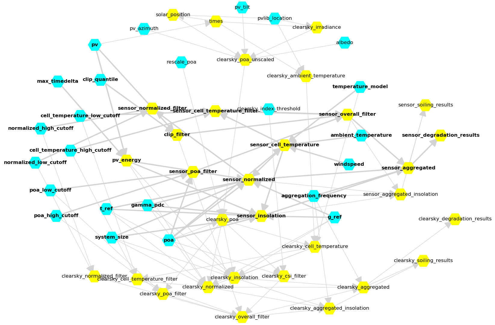

.. currentmodule:: rdtools

##############
SystemAnalysis
##############

The :py:class:`~.system_analysis.SystemAnalysis` class provides a high-level
interface around the low-level functions in the RdTools submodules.
Its purpose is to eliminate boilerplate code when running an RdTools analysis
while still allowing customization as needed.
The class is centered around a dynamic "model chain" that allows the
analysis to only calculate the intermediate values that are necessary.
It also allows the user to swap in their own models to extend or replace the
built-in functionality that RdTools provides.

Basic usage looks like this:

::

    sa = SystemAnalysis(
        pv=df['power'],
        poa=df['poa'],
        ...
    )
        
    degradation_info = sa.calculate('sensor_degradation_results')
    print(f"P50 degradation rate: {degradation_info['p50_rd']}")

Model Chain
===========

Scientific modeling frequently involves connecting many models together.
For instance, a PV cell temperature model might have inputs
POA irradiance, ambient temperature, wind speed, and thermal parameters, and
its output might be an input of an expected DC power model.  Normally those
relationships would be encoded implicitly as a sequence of imperative
programming statements like:

::

    tcell = calculate_tcell(poa, tamb, wind, thermal_params)
    p_exp = pvwatts(poa, tcell, gamma_pmpp)

Each statement mutates the state of the program and the user is responsible for
making sure all of the inputs and outputs of each function are hooked up
correctly.  For example, the ``pvwatts`` function must be called `after`
``calculate_tcell`` because otherwise its input wouldn't have been
calculated yet.
Keeping track of this control flow is an implementation requirement that
is unrelated to the modeling logic itself -- ideally, the user could
just specify the set of available models and the execution environment would be
smart enough to figure out how to chain the models together to achieve some
goal.  
For more information on this distinction, see 
`Imperative <https://en.wikipedia.org/wiki/Imperative_programming>`_ vs 
`Declarative <https://en.wikipedia.org/wiki/Declarative_programming>`_
programming. 

The :py:class:`~.system_analysis.ModelChain` inside a
:py:class:`~.system_analysis.SystemAnalysis` object is
a way of achieving this abstraction.
Each model is associated with its abstract inputs and outputs and
the SystemAnalysis object figures out how to hook them all together.

Here is a diagram of the default RdTools model chain.  The dependencies of
``sensor_degradation_results`` are bolded, showing how the chain traces
relationships when calculating outputs.  Cyan nodes are considered "primary"
inputs in that they are not provided by any default model, while yellow nodes
are considered "derived" inputs in that there is a provider model for them.

Plugins
=======

The models needed for an analysis are registered plugin-style.  Instead of
speciyfing when and where a model should be run, you register it with a 
:py:class:`~.system_analysis.SystemAnalysis` object as "requiring"
certain variables and "providing" others based on what the model needs as
inputs and what it calculates as outputs.  
For the above example of cell temperature, here's an example:

::

    @sa.plugin(requires=['poa', 'windspeed', 'ambient_temperature'],
               provides=['cell_temperature'])
    def calc_cell_temperature(poa, windspeed, ambient_temperature):
        tcell = pvlib.pvsystem.sapm_celltemp(
            poa_global=poa,
            wind_speed=windspeed,
            temp_air=ambient_temperature
        )
        return tcell['temp_cell']

Every plugin will follow this basic pattern of defining a model function and
decorating it with the metadata of what its inputs and outputs are.  
For more information on decorators in python, see 
`here <https://en.wikipedia.org/wiki/Python_syntax_and_semantics#Decorators>`_
or any of the numerous high-quality tutorials on the internet. 

If another model is registered like so:

::

    @sa.plugin(requires=['poa', 'cell_temperature', 'gamma_pmpp', 'nameplate'],
               provides=['expected_power'])
    def calc_expected_power(poa, cell_temperature, gamma_pmpp, nameplate):
        p_exp = namplate * (poa/1000) * (1 + gamma_pmpp * (tcell-25))
        return p_exp

The model chain recognizes that the ``calc_expected_power`` plugin
requires ``cell_temperature`` as an input and looks up what plugin can provide
it -- in this case, ``calc_cell_temperature``.  Providing requirement
relationships in a structured way like this allows the model chain to
dynamically calculate required inputs as needed, allowing the user to directly
request the value of ``expected_power`` without having to explicitly calculate
``cell_temperature`` beforehand -- the model chain will do it for you.

Plugins can also be "stacked" if you want to use the same code for multiple
calculation steps.  For instance:  since the default RdTools analysis
calculates POA filters based on both measured POA irradiance and modeled
clearsky POA irradiance, the same function can be used for both plugins by
stacking the ``@sa.plugin`` calls.  Here is the implementation inside RdTools:

::

    @self.plugin(requires=['clearsky_poa', 'poa_low_cutoff', 'poa_high_cutoff'],
                 provides=['clearsky_poa_filter'])
    @self.plugin(requires=['poa', 'poa_low_cutoff', 'poa_high_cutoff'],
                 provides=['sensor_poa_filter'])
    def poa_filter(poa, poa_low_cutoff, poa_high_cutoff):
        filt = filtering.poa_filter(poa, poa_low_cutoff, poa_high_cutoff)
        return filt

Registering Custom Plugins
==========================

The plugin architecture allows two cool things.  First, the default RdTools
models can be overridden with new models simply by registering a new function
that ``provides`` a given variable:

::

   In [1]: from rdtools import SystemAnalysis

   In [2]: sa = SystemAnalysis(pv=None) # make a dummy object

   In [3]: @sa.plugin(requires=['poa', 'ambient_temperature'], 
      ...:            provides=['sensor_cell_temperature'])
      ...: def my_tcell_plugin(poa, ambient_temperature):
      ...:     return 25 # dummy return value
      ...: 
   system_analysis.py:660: UserWarning: Replacing 'sensor_cell_temperature' provider 'sensor_cell_temperature' with new provider 'my_tcell_plugin'

Here the model chain recognizes that this new plugin conflicts with the default
cell temperature plugin and replaces the default with the new version.  This
allows detailed customization of the RdTools analysis pipeline without having
to worry about injecting the changes at just the right point in the calculation
process -- the results from the new plugin will get used anywhere that
``cell_temperature`` is needed.

Second, entirely new models can be inserted into the model chain.
For instance if you want to calculate monthly average cell temperature
weighted by POA irradiance, registering a plugin that provides a new variable
``poa_weighted_cell_temperature`` will automatically connect it into the
rest of the model chain and allow you to calculate it like anything else:

::

    from rdtools import SystemAnalysis
    # make a dummy object -- in reality, you would need to specify all the
    # requirements to calculate cell temperature here
    sa = SystemAnalysis(pv=None)
    @sa.plugin(requires=['poa', 'cell_temperature'],
               provides=['poa_weighted_cell_temperature'])
    def monthly_weighted_tcell(poa, cell_temperature):
        return (poa * cell_temperature).resample('m').sum() / poa.resample('m').sum()
    
    print(sa.calculate('poa_weighted_cell_temperature'))

